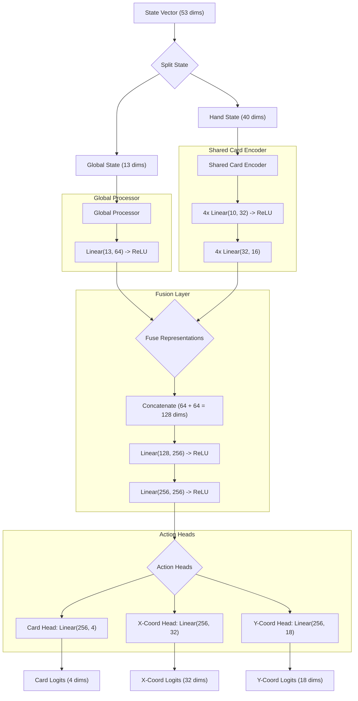

# Neural Network Architecture

This document provides a detailed explanation of the neural network architecture used in the Clash Royale RL agent.

## Structured MLP Policy

The agent uses a **Structured MLP Policy** with a shared card encoder to efficiently process the 53-dimensional state vector. This architecture is designed to handle the distinct types of information present in the game state.

### Architecture Diagram

### Detailed Component Breakdown

#### 1. State Vector

*   **Dimensions:** 53
*   **Description:** The input to the network is a 53-dimensional vector that represents the current state of the game. This vector is split into two components: the global state and the hand state.

#### 2. Global Processor

*   **Input Dimension:** 13
*   **Layers:**
    *   Linear layer with 13 input units and 64 output units.
    *   ReLU activation function.
*   **Output Dimension:** 64
*   **Description:** This component processes the 13-dimensional global state, which includes information about the player's elixir, the current time, the health of the towers, and the current phase of the game.

#### 3. Shared Card Encoder

*   **Input Dimension:** 10 (for each of the 4 cards in the hand)
*   **Layers:**
    *   Linear layer with 10 input units and 32 output units.
    *   ReLU activation function.
    *   Linear layer with 32 input units and 16 output units.
*   **Output Dimension:** 16 (for each of the 4 cards in the hand)
*   **Description:** This component processes the 10-dimensional feature vector for each of the four cards in the player's hand. The same set of weights (i.e., the same encoder) is used for all four cards, which allows the model to learn a single, general representation for cards that can be applied to any card in any slot.

#### 4. Fusion Layer

*   **Input Dimension:** 128 (64 from the Global Processor + 4 \* 16 from the Card Encoder)
*   **Layers:**
    *   Linear layer with 128 input units and 256 output units.
    *   ReLU activation function.
    *   Linear layer with 256 input units and 256 output units.
    *   ReLU activation function.
*   **Output Dimension:** 256
*   **Description:** This component fuses the representations from the Global Processor and the Card Encoder into a single, combined representation of the game state.

#### 5. Action Heads

*   **Input Dimension:** 256
*   **Description:** The fused representation is fed into three separate linear layers, or "heads," to produce the logits for each component of the action.
*   **Heads:**
    *   **Card Head:**
        *   **Output Dimension:** 4 (one for each card slot)
    *   **X-Coordinate Head:**
        *   **Output Dimension:** 32 (one for each possible x-coordinate on the game grid)
    *   **Y-Coordinate Head:**
        *   **Output Dimension:** 18 (one for each possible y-coordinate on the game grid)

This structured approach allows the model to learn more efficiently by processing the global and card-specific features separately before combining them to make a final decision about which card to play and where to deploy it.
